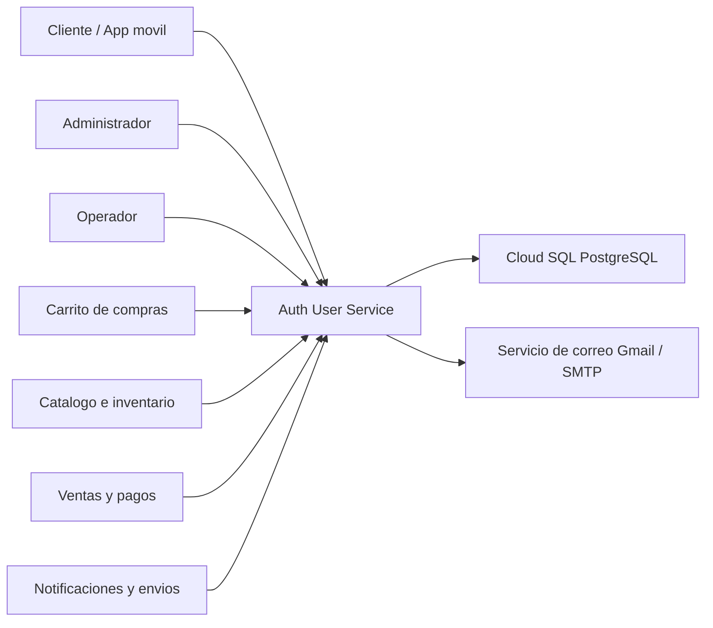
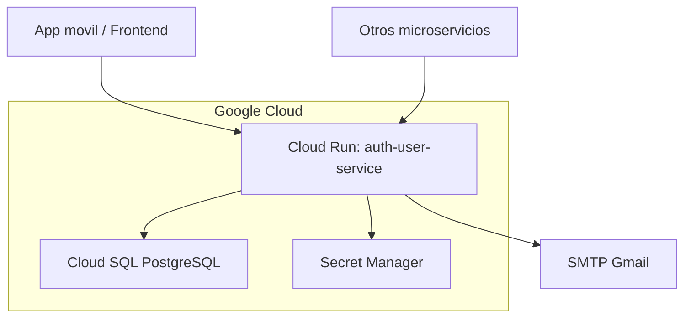
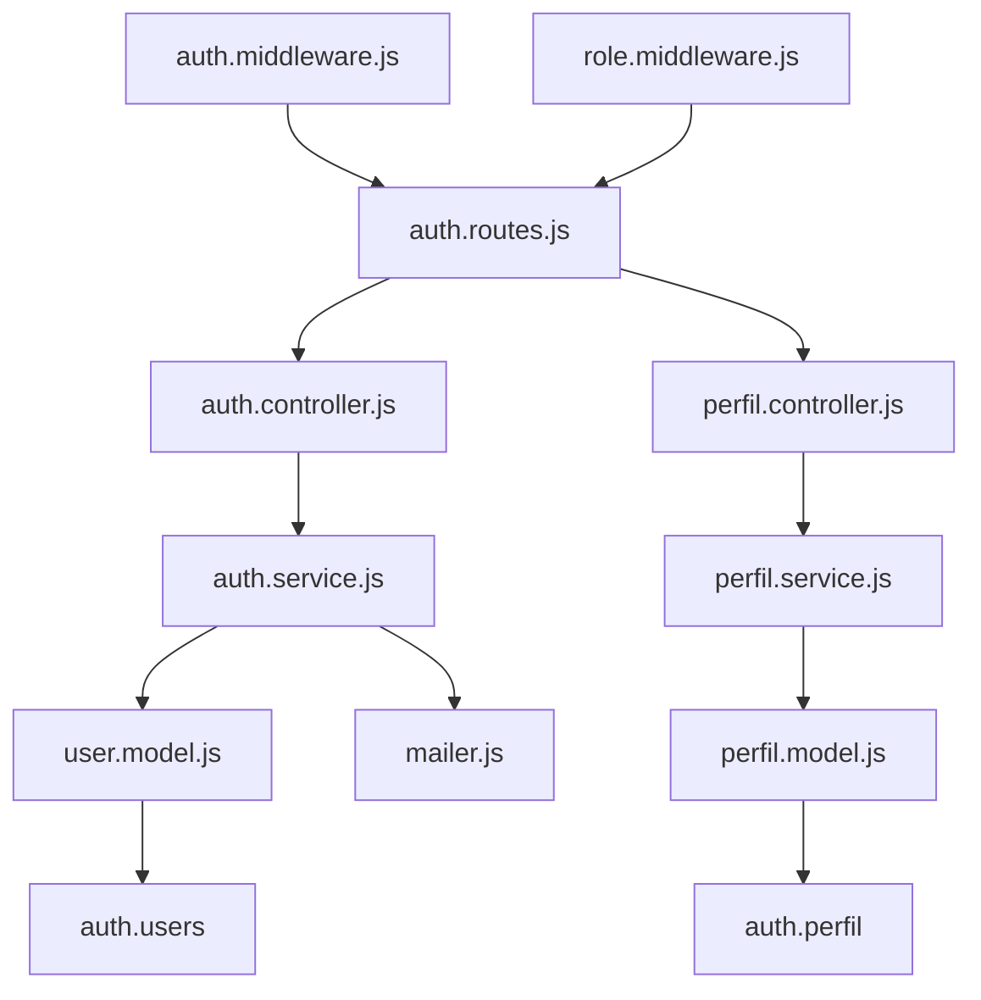

# Diagramas C4 - Auth User Service

## Nivel 1: Contexto

## Nivel 2: Contenedores

## Nivel 3: Componentes principales

## Relaciones con microservicios

| Microservicio | Endpoint consumido | Objetivo |
| --- | --- | --- |
| Carrito | `GET /auth/validate` | Validar usuario autenticado |
| Catalogo | `GET /auth/validate` | Validar rol admin u operador |
| Ventas / Pagos | `GET /auth/validate`, `GET /auth/me` | Asociar orden al usuario y obtener datos |
| Envios / Notificaciones | `GET /auth/me`, `GET /auth/perfil/datos` | Obtener datos de contacto y direccion |
