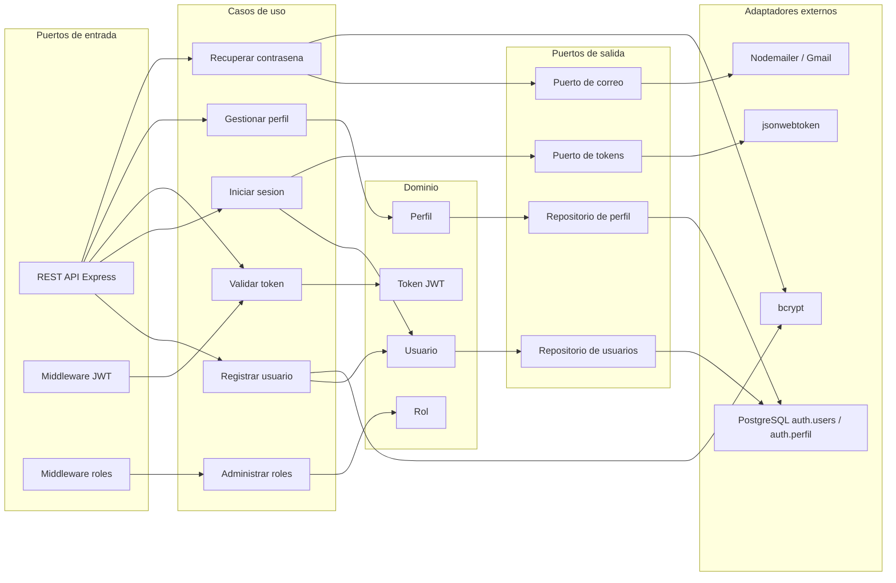

# Arquitectura Hexagonal - Auth User Service

El microservicio se puede leer como una arquitectura hexagonal aunque el proyecto este organizado con carpetas MVC. La idea principal es separar entradas HTTP, casos de uso, dominio y salidas externas.

## Diagrama

## Puertos de entrada

- `POST /auth/registro`
- `POST /auth/login`
- `GET /auth/validate`
- `GET /auth/me`
- `POST /auth/perfil`
- `GET /auth/perfil/datos`
- `PUT /auth/perfil/actualizar`
- `POST /auth/forgot-password`
- `POST /auth/reset`
- Rutas administrativas protegidas por rol admin

## Puertos de salida

- PostgreSQL para persistencia de usuarios y perfiles.
- SMTP para correos de recuperacion.
- JWT para creacion y validacion de tokens.
- bcrypt para cifrado de contrasenas.

## Adaptadores

- `src/routes`: adaptador HTTP de entrada.
- `src/controllers`: coordinacion entre HTTP y casos de uso.
- `src/services`: casos de uso y reglas de negocio.
- `src/models`: adaptador de persistencia PostgreSQL.
- `src/utils/mailer.js`: adaptador de correo.
- `src/middlewares`: adaptadores de seguridad.
